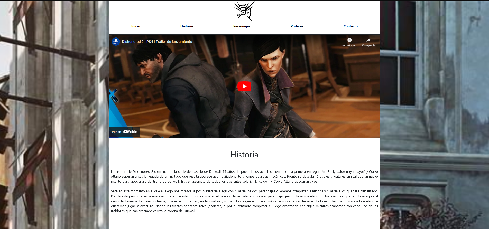
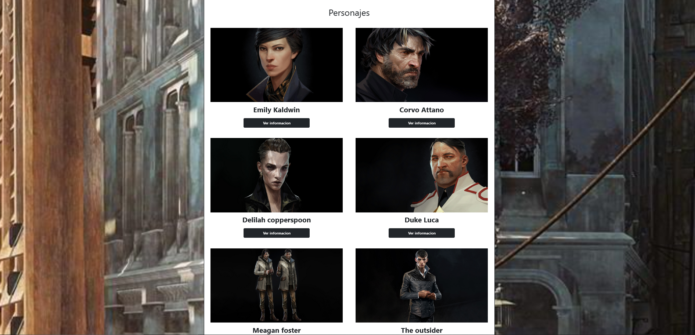

# DishonoredBootstrap

This is a bootstrap project based on making a web page for the video game Dishonored 2.

---

## Table of contents

- [Description](#description)
- [Technologies](#technologies)
- [Installation](#installation)

## Description

This is a bootstrap project based on making a web page for the video game Dishonored 2. In this project we will be able to see information about the Dishonored 2 game, such as its characters, lore and history.

## Technologies

The project has been created with:

- HTML
- CSS
- JS
- BOOTSTRAP 5

## Installation

To run this project, we need the following steps:

- Download the Live Server extension, which is found in the vscode editor

- Once the extension is downloaded, run the extension and everything will work correctly

- If you get an error, try running the application normally using the index.html file
